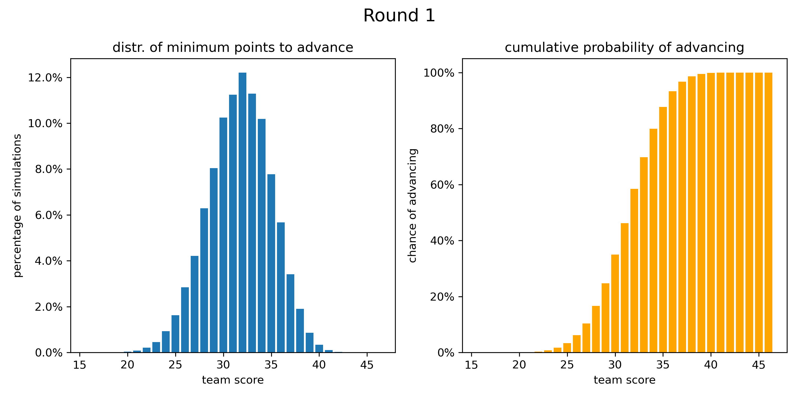

# Fall guys simulator
This python script creates histogram diagrams (saved as '.png' files) that visualise the probability of advancing in a round in the PlayStation game "Fall Guys". It is designed for the cooperative (coop) game mode.

## Features
The following parameters can be customised in the 'main' function:
- **Number of teams**: Adjust the total number of teams participating in the round.
- **Number of advancing teams**: Set the number of teams that advance to the next round.
- **Number of simulations**: Determine how many times the round is simulated. A higher number of simulations results in more accurate probabilities.
- **Round number**: Customize the round number for the diagram title.

### Purpose
The images generated by this script help you estimate the likelihood of qualifying for the next round when you’re waiting at the finish line. By analyzing these probabilities, you can decide whether it’s worth waiting or if your team’s current score is likely sufficient to advance.

### Example
Below is a diagram for a common round 1 in fall guys coop mode:

In this example, there is a total of 20 teams of which 14 advance. From the graph one can deduce that you need 34 points to advance with a 80 % likelihood.